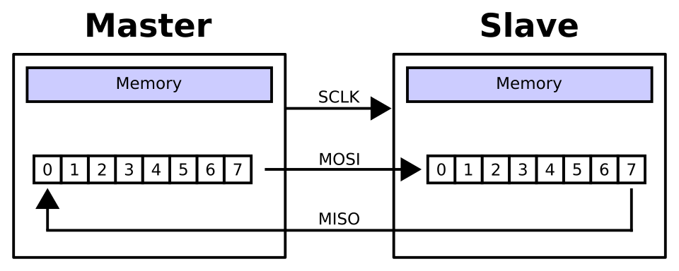

# EEPROM-SPI

- [Описание](#описание)
- [Сборка на UNIX-системе](#сборка-на-unix-системе)
- [EEPROM и SPI](#eeprom-и-spi)
    - [Особенности EERPOM](#особенности-eerpom)
    - [Интерфейс SPI](#интерфейс-spi)
    - [Bit-banging](#bit-banging)

## Описание

Проект реализует C++ класс для работы с EEPROM 25LC040A через интерфейс SPI, используя существующий драйвер на базе bit-banging

## Сборка на UNIX-системе
Для сборки бинарника воспользуйтесь в терминале следующей командой:
```bash
./build.sh
```

## UML-даиграмма классов


## EEPROM и SPI

### Особенности EERPOM

***Микросхема EERPOM*** - Микросхема EEPROM (Electrically Erasable Programmable Read-Only Memory) — это энергонезависимая память, позволяющая электрически стирать и перезаписывать данные побайтов

- Энергонезависимость: Данные сохраняются при отключении питания.
- Побайтовая запись: В отличие от Flash-памяти, классическая EEPROM позволяет изменять данные отдельными байтами, а не блоками. 
- У EEPROM есть размер страницы. Размер страницы в EEPROM — это количество байт (обычно 16, 32 или 64), записываемых за один цикл
- Ограниченный ресурс перезаписи данных - 100000 циклов
- Низкая скорость перезаписи данных
- Нет ограничения на количество чтений данных
- Возможны ошибки записи при нестабильном питании
- Диапазон адресов: [0, (объём памяти - 1)]

### Интерфейс SPI

***Интерфейс SPI EEPROM*** — это метод подключения энергонезависимой памяти (EEPROM) к микроконтроллеру с использованием синхронного последовательного протокола SPI. Он обеспечивает высокоскоростной, полнодуплексный обмен данными по 4-м линиям, позволяя быстро записывать и считывать небольшие объемы данных (настройки, калибровки).

*Принцип подключения:* Master (контроллер) управляет Slave (памятью) через линии: SCK (синхронизация), MOSI (данные к памяти), MISO (данные от памяти), CS или SS (выбор устройства).

*Основные линии SPI:*
1. MOSI (Master Out Slave In): Передача данных от ведущего к памяти.
2. MISO (Master In Slave Out): Передача данных от памяти к ведущему.
3. SCK (Serial Clock): Тактовый сигнал, генерируемый ведущим.
4. CS/SS (Chip Select/Slave Select): Линия выбора микросхемы памяти. 

#### Передача данных

<div style="background:#ffffff; margin-bottom:20px;">
    
</div>

***Принцип работы передачи данных:***

***SPI*** является синхронным интерфейсом, в котором любая передача синхронизирована с общим тактовым сигналом, генерируемым ведущим устройством.

***Передача данных*** осуществляется пакетами. Длина пакета, как правило, составляет 1 байт (8 бит), при этом известны реализации SPI с иной длиной пакета, например, 4 бита. Ведущее устройство инициирует цикл связи установкой низкого уровня на выводе выбора подчиненного устройства (SS) - того устройства, с которым необходимо установить соединение. При низком уровне сигнала SS:
- схемотехника ведомого устройства находится в активном состоянии;
- вывод MISO переводится в режим «выход»;
- тактовый сигнал SCLK от ведущего устройства воспринимается ведомым и вызывает считывание на входе MOSI значений передаваемых от ведущего битов и сдвиг регистра ведомого устройства.

Подлежащие передаче данные ведущее и ведомое устройства помещают в сдвиговые регистры. После этого ведущее устройство начинает генерировать импульсы синхронизации на линии SCLK, что приводит к взаимному обмену данными. Передача данных осуществляется бит за битом от ведущего по линии MOSI и от ведомого по линии MISO. Передача осуществляется, как правило, начиная со старших битов, но некоторые производители допускают изменение порядка передачи битов программными методами. После передачи каждого пакета данных ведущее устройство, в целях синхронизации ведомого устройства, может перевести линию SS в высокое состояние.

### Bit-banging

***Bit-banging (побитовый обмен)*** — это метод реализации последовательной передачи данных, при котором протоколы связи (например, I²C, SPI, UART) эмулируются программно с помощью обычных портов ввода-вывода (GPIO) микроконтроллера, а не специальными аппаратными модулями. Программа напрямую управляет состоянием контактов (высокий/низкий уровень) и таймингами. 

***GPIO (General-Purpose Input/Output)*** — это интерфейс ввода/вывода общего назначения на микроконтроллерах (Arduino, STM32) и одноплатных компьютерах (Raspberry Pi), позволяющий программно управлять цифровыми сигналами.

***Драйвер*** — это программное обеспечение (библиотека или модуль ОС), которое позволяет прикладной программе управлять физическими выводами (пинами) микросхемы, вручную переключая логические уровни (0 или 1) на её линиях ввода-вывода (bit-banging). Это низкоуровневый интерфейс между ПО и аппаратной частью. 

*Принцип работы:* Процессор «вручную» устанавливает 0 или 1 на пине, делает задержки для соответствия скорости (baud rate) и считывает данные с других пинов.

*Применение:* Используется, когда в микроконтроллере не хватает аппаратных интерфейсов или они заняты.